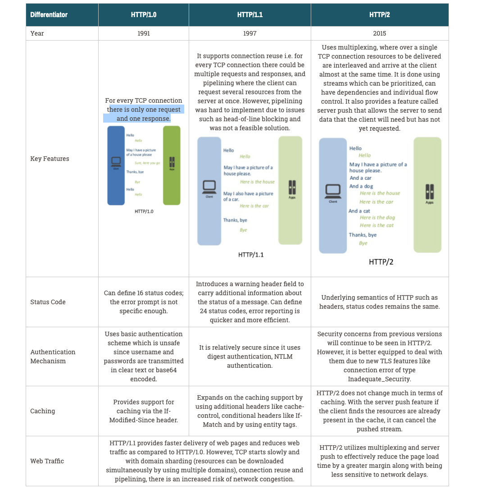

# System-Design-Preparation


## Back Of Envelope Calculations

Back of envelope calculations is a technique used within software engineering to determine how a system should be 
designed. The method is most famous from big tech companies and is often expected in system design interviews.
The thought is that you should first calculate some rough numbers so that it can drive decisions in designing possible 
solutions.


### Some Useful Calculation For Storage

#### Byte Number Sizes

The number of zeros after thousands increments by 3.
1. Thousands = KB (3 zeros)
2. Millions = MB(6 zeros)
3. Billions = GB (9 zeros)
4. Trillions = TB (12 zeros)
5. Quadrilions = PB (15 zeros)

##### Some quick Calculation 

1. x Million * y KB = xy GB 
2. ###### x Million * y MB = xy TB

##### Byte Conversions

1. 1B = 8bits
2. 1KB = 1000B
3. 1MB = 1000KB
4. 1GB = 1000MB


### Some Useful Calculation For Request


|Day     | 1 Billion | 1 Million | 
|--------|-----------|-----------|
|Hour    | 42M       | 42K       |
|Minute  | 700K      |  700      |
|Seconds | 12K       |  12       |


You'll sometimes be asked to do 'back-of-the-envelope' estimates.  For example, you might need to determine how long it will take to generate 100 image thumbnails from disk or how much memory a data structure will take.  The **Powers of two table** and **Latency numbers every programmer should know** are handy references.

### Powers of two table

```
Power           Exact Value         Approx Value        Bytes
---------------------------------------------------------------
7                             128
8                             256
10                           1024   1 thousand           1 KB
16                         65,536                       64 KB
20                      1,048,576   1 million            1 MB
30                  1,073,741,824   1 billion            1 GB
32                  4,294,967,296                        4 GB
40              1,099,511,627,776   1 trillion           1 TB
```

#### Source(s) and further reading

* [Powers of two](https://en.wikipedia.org/wiki/Power_of_two)

### Latency numbers every programmer should know

```
Latency Comparison Numbers
--------------------------
L1 cache reference                           0.5 ns
Branch mispredict                            5   ns
L2 cache reference                           7   ns                      14x L1 cache
Mutex lock/unlock                           25   ns
Main memory reference                      100   ns                      20x L2 cache, 200x L1 cache
Compress 1K bytes with Zippy            10,000   ns       10 us
Send 1 KB bytes over 1 Gbps network     10,000   ns       10 us
Read 4 KB randomly from SSD*           150,000   ns      150 us          ~1GB/sec SSD
Read 1 MB sequentially from memory     250,000   ns      250 us
Round trip within same datacenter      500,000   ns      500 us
Read 1 MB sequentially from SSD*     1,000,000   ns    1,000 us    1 ms  ~1GB/sec SSD, 4X memory
HDD seek                            10,000,000   ns   10,000 us   10 ms  20x datacenter roundtrip
Read 1 MB sequentially from 1 Gbps  10,000,000   ns   10,000 us   10 ms  40x memory, 10X SSD
Read 1 MB sequentially from HDD     30,000,000   ns   30,000 us   30 ms 120x memory, 30X SSD
Send packet CA->Netherlands->CA    150,000,000   ns  150,000 us  150 ms

Notes
-----
1 ns = 10^-9 seconds
1 us = 10^-6 seconds = 1,000 ns
1 ms = 10^-3 seconds = 1,000 us = 1,000,000 ns
```

Handy metrics based on numbers above:

* Read sequentially from HDD at 30 MB/s
* Read sequentially from 1 Gbps Ethernet at 100 MB/s
* Read sequentially from SSD at 1 GB/s
* Read sequentially from main memory at 4 GB/s
* 6-7 world-wide round trips per second
* 2,000 round trips per second within a data center

#### Latency numbers visualized


#### Source(s) and further reading

* [Latency numbers every programmer should know - 1](https://gist.github.com/jboner/2841832)
* [Latency numbers every programmer should know - 2](https://gist.github.com/hellerbarde/2843375)
* [Designs, lessons, and advice from building large distributed systems](http://www.cs.cornell.edu/projects/ladis2009/talks/dean-keynote-ladis2009.pdf)
* [Software Engineering Advice from Building Large-Scale Distributed Systems](https://static.googleusercontent.com/media/research.google.com/en//people/jeff/stanford-295-talk.pdf)

## Networking


### Networking Models

Network model is define as an architecture, design and components to send data from a source to destination. 

#### TCP/IP Model

Link Layer: protocols relevant to a local network, called a “link” or “IP network”. These computers are physically wired on the same network and don’t need a router to communicate, e.g. MAC addresses
Internet Layer: protocols relevant to connecting different IP networks, e.g. IPv6
Transport Layer: protocols for direct communication channels over the internet, e.g. TCP
Application Layer: protocols relevant to applications sending data to and from users over the internet, e.g. HTTPj

### OSI Model  

Physical Layer: transmission of raw data on hardware. e.g. Ethernet
Data Link Layer: establishing connection for data transfer between computers in the same physical network, e.g. MAC addresses
Network Layer: establishing connection for data transfer in packets between computers in different networks. e.g. IP 
Transport Layer: transferring data with reliable quality. e.g. TCP
Session Layer: managing data transfer sessions between computers. 
Presentation Layer: translating lower layer data formats for use by the application layer.
Application Layer: application-enabling functionality. e.g. HTTP
 
 
### Difference between TCP and UDP.

What is TCP?

Transmission Control Protocol (TCP) is a protocol that is design to send data across the internet by making sure successful delivery of data and messages over networks.  

TCP organizes data so that it can be transmitted between a server and a client. Initially, TCP creates a connection between source and destination using three-way handshake. 
Then source computer start sending packets to the destination computer. The destination computer will have to send an acknowledgement of each packet it received. 
TCP protocol provide ability for detecting out of order and lost packets. 
   
[more details](https://www.khanacademy.org/computing/computers-and-internet/xcae6f4a7ff015e7d:the-internet/xcae6f4a7ff015e7d:transporting-packets/a/transmission-control-protocol--tcp) 

What is UDP?

User Datagram Protocol (UDP) is a simpler, connectionless Internet protocol wherein error-checking and recovery services are not required. With UDP, there is no overhead for opening a connection, maintaining a connection, or terminating a connection; data is continuously sent to the recipient, whether or not they receive it. 
Although UDP isn’t ideal for sending an email, viewing a webpage, or downloading a file, it is largely preferred for real-time communications like broadcast or multitask network transmission.

[more details](https://www.khanacademy.org/computing/computers-and-internet/xcae6f4a7ff015e7d:the-internet/xcae6f4a7ff015e7d:transporting-packets/a/user-datagram-protocol-udp)

 


[Reference](https://www.lifesize.com/en/blog/tcp-vs-udp/)

### Understand how DNS works.


### HTTP 

HTTP (Hyper Text Transfer Protocol) is application layer protocol that is sent over TCP which allows web based 
applications to communicate andexchange data. HTTP  is a connectionless and stateless protocol in which any sort of data 
can be transfer if both computers can understand. HTTP is a client-server protocol: requests are sent by the client to the s
erver which handles it and then provides a response.

[Further Reading](https://developer.mozilla.org/en-US/docs/Web/HTTP/Overview) 

#### HTTP Flow 

1. Open a TCP connection: The TCP connection is used to send a request, The client may open a new connection, reuse an existing connection, or open several TCP connections to the servers.
2. Send an HTTP message
3. Read the response sent by the server
4. Close or reuse the connection for further requests.


#### HTTP 1.0 vs HTTP 1.1 vs HTTP 2.0



[Reference](https://cheapsslsecurity.com/p/http2-vs-http1/)


### WebSockets


### Rest API  

https://igotanoffer.com/blogs/tech/network-protocols-proxies-system-design-interview
https://www.section.io/engineering-education/networking-models-introductory-guide/
https://learning.oreilly.com/library/view/packet-guide-to/9781449308094/ch01.html#osi_model


