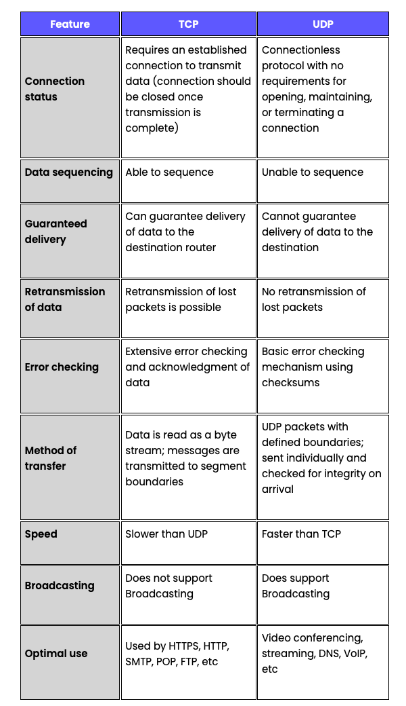
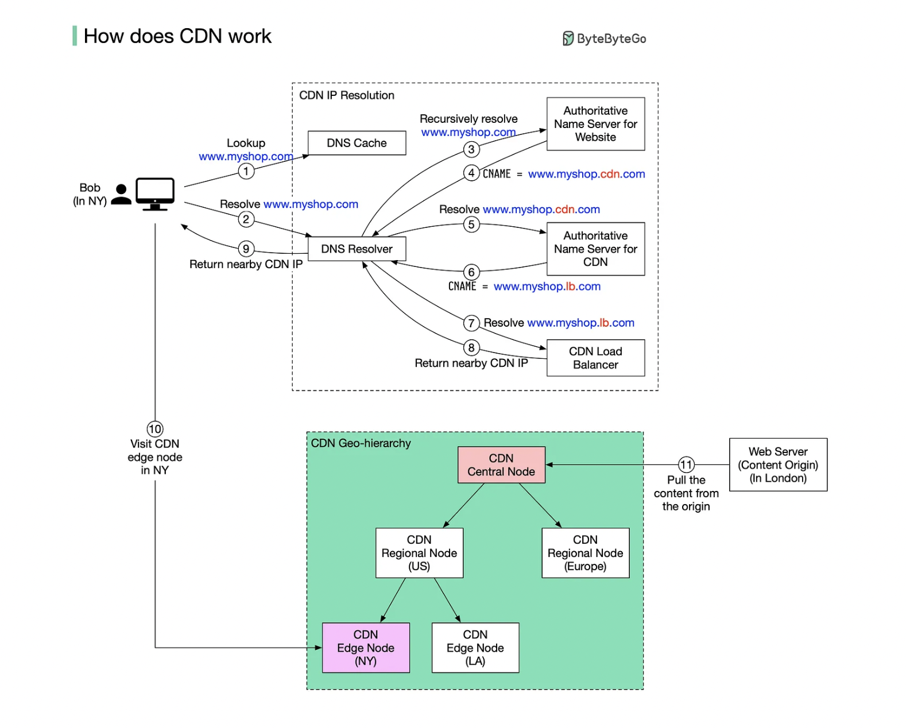

## Networking Models

Network model is define as an architecture, design and components to send data from a source to destination.

### TCP/IP Model

* Link Layer: protocols relevant to a local network, called a “link” or “IP network”. These computers are physically wired on the same network and don’t need a router to communicate, e.g. MAC addresses 
* Internet Layer: protocols relevant to connecting different IP networks, e.g. IPv6
* Transport Layer: protocols for direct communication channels over the internet, e.g. TCP
* Application Layer: protocols relevant to applications sending data to and from users over the internet, e.g. HTTP

## OSI Model

1. Physical Layer: transmission of raw data on hardware. e.g. Ethernet
2. Data Link Layer: establishing connection for data transfer between computers in the same physical network, e.g. MAC addresses
3. Network Layer: establishing connection for data transfer in packets between computers in different networks. e.g. IP
4. Transport Layer: transferring data with reliable quality. e.g. TCP
5. Session Layer: managing data transfer sessions between computers.
6. Presentation Layer: translating lower layer data formats for use by the application layer.
7. Application Layer: application-enabling functionality. e.g. HTTP

## Difference between TCP and UDP.

What is TCP?

Transmission Control Protocol (TCP) is a protocol that is design to send data across the internet by making sure successful delivery of data and messages over networks.

TCP organizes data so that it can be transmitted between a server and a client. Initially, TCP creates a connection between source and destination using three-way handshake.
Then source computer start sending packets to the destination computer. The destination computer will have to send an acknowledgement of each packet it received.
TCP protocol provide ability for detecting out of order and lost packets.

[more details](https://www.khanacademy.org/computing/computers-and-internet/xcae6f4a7ff015e7d:the-internet/xcae6f4a7ff015e7d:transporting-packets/a/transmission-control-protocol--tcp)

What is UDP?

User Datagram Protocol (UDP) is a simpler, connectionless Internet protocol where in error-checking and recovery services are not required. With UDP, there is no overhead for opening a connection, maintaining a connection, or terminating a connection; data is continuously sent to the recipient, whether or not they receive it.
Although UDP isn’t ideal for sending an email, viewing a webpage, or downloading a file, it is largely preferred for real-time communications like broadcast or multitask network transmission.

[more details](https://www.khanacademy.org/computing/computers-and-internet/xcae6f4a7ff015e7d:the-internet/xcae6f4a7ff015e7d:transporting-packets/a/user-datagram-protocol-udp)

[Reference](https://www.lifesize.com/en/blog/tcp-vs-udp/)

## HTTP

HTTP (Hyper Text Transfer Protocol) is application layer protocol that is sent over TCP which allows web based
applications to communicate andexchange data. HTTP  is a connectionless and stateless protocol in which any sort of data
can be transfer if both computers can understand. HTTP is a client-server protocol: requests are sent by the client to the
server which handles it and then provides a response.

[Further Reading](https://developer.mozilla.org/en-US/docs/Web/HTTP/Overview)

### HTTP Flow

1. Open a TCP connection: The TCP connection is used to send a request, The client may open a new connection, reuse an existing connection, or open several TCP connections to the servers.
2. Send an HTTP message
3. Read the response sent by the server
4. Close or reuse the connection for further requests.

### HTTP 1.0 vs HTTP 1.1 vs HTTP 2.0

[Reference](https://cheapsslsecurity.com/p/http2-vs-http1/)

## Proxies

### Forward Proxies 

A forward proxy sits between a pool of clients and the public internet. The goal of a forward proxy is to protect the particular client pool by filtering outgoing requests and incoming responses.

**_Example 1: Corporate Network_**

Imagine a corporate environment where multiple employees are using the company's network to access the internet. The company sets up a forward proxy to filter and control the internet traffic generated by its employees.

**Client Pool:** Employees within the company's network.
**Goal:** Protect the company's network from potentially harmful or inappropriate content, as well as to monitor internet usage.

How it works:
1. An employee wants to access a website (e.g., www.example.com).
2. Instead of directly connecting to the website, the employee's request goes to the forward proxy.
3. The forward proxy evaluates the request and checks its filtering rules. If the request meets the criteria, it forwards the request to the internet.
4. The website's server responds to the proxy.
5. The proxy inspects the response and, if allowed, sends the response back to the requesting employee.

### Reverse Proxies
A reverse proxy is a server that sits between clients and backend servers. Unlike a forward proxy, which is positioned between clients and the internet, a reverse proxy is deployed on the server side and is responsible for distributing client requests to appropriate backend servers. It acts as an intermediary for incoming requests from clients and provides various benefits, such as load balancing, security, and caching.

## Understand how DNS works.

DNS acts as an address book. It translates human-readable domain names (google.com) to machine-readable IP addresses (142.251.46.238). 
To achieve better scalability, the DNS servers are organized in a hierarchical tree structure. The root of the tree is 
the root name server, which is responsible for delegating requests to the appropriate top-level domain (TLD) name server. 
The TLD name server then delegates the request to the authoritative name server, which is responsible for the domain name in question.

## Understand How CDN Works

A content delivery network (CDN) refers to geographically distributed servers (also called edge servers) that provide fast delivery of static and dynamic content. Let’s take a look at how it works. 
Suppose Bob who lives in New York wants to visit an eCommerce website that is deployed in London. If the request goes to servers located in London, the response will be quite slow. So we deploy CDN servers close to where Bob lives, and the content will be loaded from the nearby CDN server.

### Push CDNs

Push CDNs receive new content whenever changes occur on your server. You take full responsibility for providing content, uploading directly to the CDN and rewriting URLs to point to the CDN. You can configure when content expires and when it is updated. Content is uploaded only when it is new or changed, minimizing traffic, but maximizing storage.
Sites with a small amount of traffic or sites with content that isn't often updated work well with push CDNs. Content is placed on the CDNs once, instead of being re-pulled at regular intervals.

### Pull CDNs
Pull CDNs grab new content from your server when the first user requests the content. You leave the content on your server and rewrite URLs to point to the CDN. This results in a slower request until the content is cached on the CDN.
A time-to-live (TTL) determines how long content is cached. Pull CDNs minimize storage space on the CDN, but can create redundant traffic if files expire and are pulled before they have actually changed.
Sites with heavy traffic work well with pull CDNs, as traffic is spread out more evenly with only recently-requested content remaining on the CDN.

## WebSockets

## Rest API

https://igotanoffer.com/blogs/tech/network-protocols-proxies-system-design-interview
https://www.section.io/engineering-education/networking-models-introductory-guide/
https://learning.oreilly.com/library/view/packet-guide-to/9781449308094/ch01.html#osi_model
https://blog.bytebytego.com/p/how-does-the-domain-name-system-dns
https://blog.bytebytego.com/p/how-does-cdn-work

